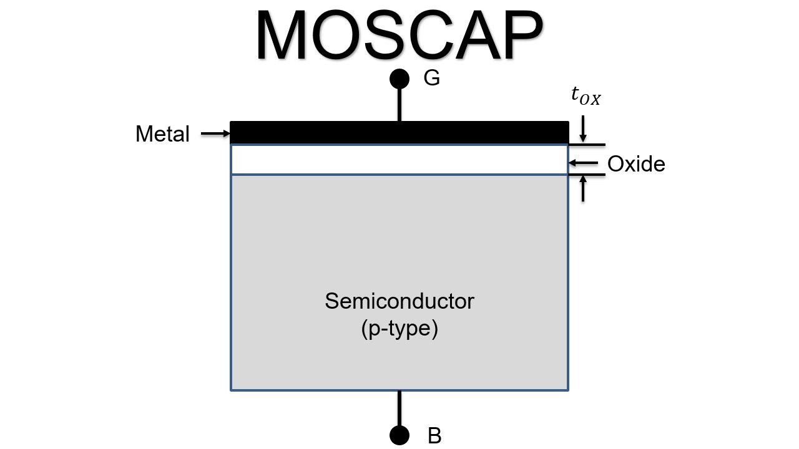

# **MOS Capacitor: A Detailed Overview**

## **Introduction**  
A **MOS (Metal-Oxide-Semiconductor) capacitor** is one of the fundamental building blocks in semiconductor devices and forms the basis of MOSFETs (Metal-Oxide-Semiconductor Field-Effect Transistors). It consists of a metal gate, an insulating oxide layer, and a semiconductor substrate. Understanding the MOS capacitor is critical to grasp modern electronic device operation.

---

## **Structure**  
A typical MOS capacitor consists of three layers:  
1. **Metal Gate**: Traditionally aluminum, but modern devices often use heavily-doped polysilicon due to its process compatibility and work function tunability.
2. **Oxide Layer**: An insulating layer, typically silicon dioxide (SiO₂), though modern devices may use high-k dielectrics like HfO₂ to reduce leakage current.
3. **Semiconductor**: Usually silicon substrate, which can be p-type or n-type depending on doping. The doping concentration affects the threshold voltage and capacitance characteristics.

### **Diagram**  
Below is an example diagram of a MOS capacitor structure:

  

---

## **Working Principle**  

The MOS capacitor operation depends on the gate voltage (VG) relative to the substrate. The behavior can be classified into four distinct regimes:

### **1. Accumulation**  
- **Condition**: VG < VFB (Flat-band voltage) for p-type substrate
- **Effect**: Majority carriers (holes) accumulate at the oxide-semiconductor interface
- **Characteristics**: Maximum capacitance, equal to Cox

### **2. Flat-band**
- **Condition**: VG = VFB
- **Effect**: No band bending, no net charge in semiconductor
- **Characteristics**: Represents the reference point for voltage measurements

### **3. Depletion**  
- **Condition**: VFB < VG < VTH (Threshold voltage)
- **Effect**: 
  - Majority carriers are repelled, forming a depletion region
  - Width of depletion region increases with gate voltage
  - Total capacitance decreases due to series combination of Cox and depletion capacitance

### **4. Inversion**  
- **Condition**: VG > VTH
- **Effect**: 
  - Strong band bending attracts minority carriers
  - Forms an inversion layer of electrons (for p-type)
  - Depletion width reaches maximum
- **Characteristics**:
  - Low frequency: Capacitance returns to Cox
  - High frequency: Capacitance remains at minimum due to minority carrier response limitations

---

## **Key Parameters**  

### **1. Threshold Voltage V_th**  
The voltage at which inversion begins. It depends on:  
- Work function difference between the metal and semiconductor.  
- Doping concentration in the substrate.  
- Oxide thickness.  

### **2. Capacitance C**  
The capacitance behavior depends on measurement frequency:
- **Low Frequency (< 100 Hz)**:
  - Accumulation: C = Cox
  - Depletion: C decreases with VG
  - Inversion: C returns to Cox
- **High Frequency (> 1 kHz)**:
  - Accumulation: C = Cox
  - Depletion: C decreases with VG
  - Inversion: C remains at minimum

---

## **Energy Band Diagrams**  

### **1. Flat-Band Condition**  
- The flat-band voltage (VFB) is given by:
  VFB = ΦMS - Qf/Cox
  where:
  - ΦMS is the metal-semiconductor work function difference
  - Qf is the fixed oxide charge
  - Cox is the oxide capacitance

### **2. Accumulation**  
- Energy bands bend upward.  
- Holes accumulate at the interface.  

### **3. Depletion**  
- Energy bands bend downward, away from the Fermi level.  
- The region near the oxide interface becomes depleted of majority carriers.  

### **4. Inversion**  
- Bands bend significantly downward.  
- The minority carrier concentration exceeds that of the majority carriers near the interface.  

---

## **Mathematical Analysis**  

### **Capacitance**  

The total capacitance in depletion mode:

1/Ctotal = 1/Cox + 1/Cd

Where:
- Cox = εox·A/tox (oxide capacitance)
- Cd = εsi·A/Wd (depletion capacitance)
- εox: oxide permittivity
- εsi: silicon permittivity
- A: gate area
- tox: oxide thickness
- Wd: depletion width

The maximum depletion width is:
Wd(max) = √(4εsi·ΦF/qNA)
where ΦF is the Fermi potential and NA is the acceptor concentration.

---

## **Applications**  

1. **MOSFETs**: MOS capacitors form the gate structure in MOSFETs.  
2. **Dynamic RAM**: Used to store charge in memory cells.  
3. **Sensors**: MOS structures are used in gas sensors and other semiconductor-based sensors.  

---

## **Summary**  

The MOS capacitor is a simple yet versatile device critical for modern electronics. It showcases how electric fields control charge distribution, forming the foundation for transistors and memory devices. Mastering its working is a stepping stone for understanding semiconductor physics and device engineering.  

---

## **References**  
- "Semiconductor Device Fundamentals" by Robert F. Pierret.  
- Online materials from IEEE Xplore and similar educational sources.  
