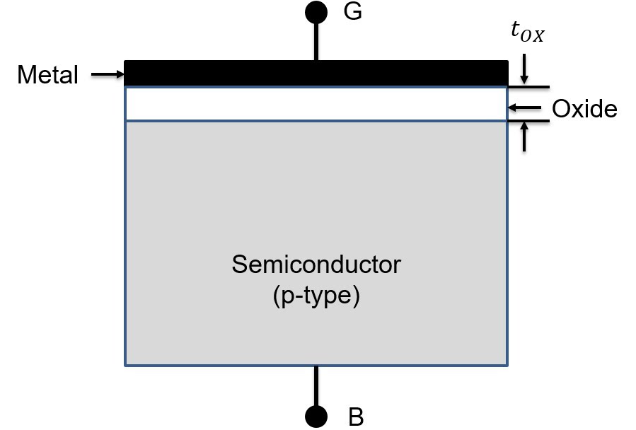
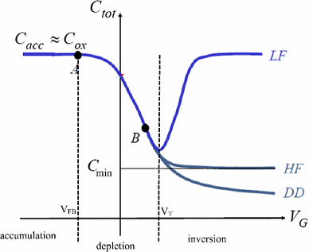
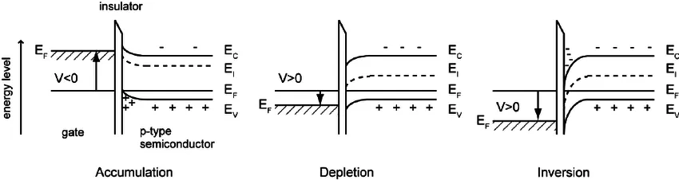
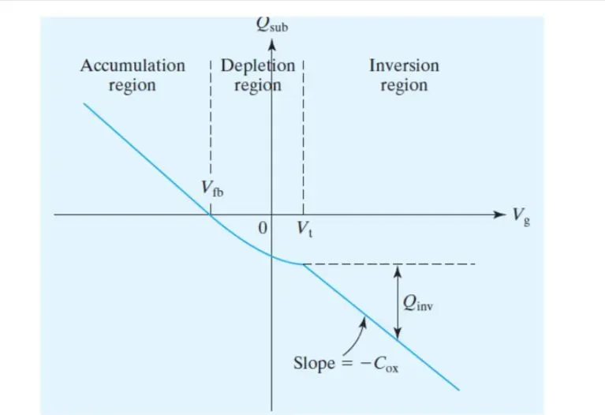

A **MOS (Metal-Oxide-Semiconductor) capacitor** is one of the fundamental building blocks in semiconductor devices and forms the basis of MOSFETs (Metal-Oxide-Semiconductor Field-Effect Transistors). It consists of a metal gate, an insulating oxide layer, and a semiconductor substrate. Understanding the MOS capacitor is critical to grasp modern electronic device operation.

---

## **Structure**  
A typical MOS capacitor consists of three layers:  
1. **Metal Gate**: Traditionally aluminum, but modern devices often use heavily-doped polysilicon due to its process compatibility and work function tunability.
2. **Oxide Layer**: An insulating layer, typically silicon dioxide (SiO₂), though modern devices may use high-k dielectrics like HfO₂ to reduce leakage current.
3. **Semiconductor**: Usually silicon substrate, which can be p-type or n-type depending on doping. The doping concentration affects the threshold voltage and capacitance characteristics.

### **Diagram**  
Below is an example diagram of a MOS capacitor structure:

  

---

## **Working Principle**  

The MOS capacitor operation depends on the gate voltage (Vgs)
 relative to the substrate. The behavior can be classified into four distinct regimes:

### **1. Accumulation**  
Accumulation occurs in a Metal-Oxide-Semiconductor (MOS) capacitor when a voltage is applied to the gate such that it attracts majority carriers to the semiconductor-oxide interface. This happens when the gate voltage (Vgb with respect to body/substrate voltage​) is more negative for a p-type semiconductor or more positive for an n-type semiconductor
- **Condition**: Accumulation occurs when the gate voltage attracts majority carriers to the oxide–semiconductor interface (negative gate voltage for p-type substrate and positive gate voltage for n-type substrate).
- **Effect**: Majority carriers (holes in p-type and electrons in n-type) accumulate below the oxide-semiconductor interface
- **Characteristics**: Maximum capacitance between gate and substrate, equal to Cox

### **2. Flat-band**
The flat-band voltage (Vfb) in a Metal-Oxide-Semiconductor (MOS) capacitor is the voltage applied to the gate that ensures the energy bands in the semiconductor are flat, meaning there is no band bending at the semiconductor-oxide interface. This condition occurs when there is no net charge in the semiconductor, and the surface potential ϕs(potential of semiconductor just under the oxide) is zero.
- **Condition**: Vgb = Vfb
- **Effect**: No band bending, no space-charge region exists in the semiconductor; however, fixed oxide charges or interface charges may still be present
- **Characteristics**: Represents the reference point for voltage measurements

### **3. Depletion**  
- **Condition**: Vfb < Vgb < Vth (Threshold voltage)
- **Effect**: 
  - Majority carriers are repelled, forming a depletion region
  - Width of depletion region increases with gate voltage
  - Total capacitance decreases due to series combination of Cox and depletion capacitance

### **4. Inversion**  
- **Condition**: Vgb > Vth
- **Effect**: 
  - Strong band bending attracts minority carriers
  - Forms an inversion layer of minority carriers from substrate of electrons (for p-type) and holes (for n-type substrate).
  - At inversion, magnitude of carrier concentration in inversion layer is same as the majority carrier in the bulk.
  - Depletion width reaches maximum
- **Characteristics**:
  - Low frequency: Capacitance returns to Cox
  - High frequency: Capacitance remains at its minimum at high frequency because minority carriers cannot respond fast enough to the AC signal, so only the depletion layer contributes

---

## **Capacitance-Voltage (C-V) Characteristics**

The C-V curve is one of the most important characterization tools for understanding MOS capacitor behavior. It shows how the total capacitance varies with applied gate voltage and reveals the different operating regions.

### **Understanding the C-V Curve**

The C-V characteristic curve displays three distinct regions corresponding to the operating modes:

#### **1. Accumulation Region (VG < Vfb)**
- **Capacitance**: Ctot ≈ Cox (maximum capacitance)
- The majority carriers accumulate at the oxide-semiconductor interface
- The total capacitance is approximately equal to the oxide capacitance since the accumulation layer acts like a metal plate
- Both low-frequency (LF) and high-frequency (HF) curves coincide in this region

#### **2. Depletion Region (Vfb < VG < Vth)**
- **Capacitance**: Decreases as depletion width increases
- The capacitance follows: Ctot = (Cox × Cdep)/(Cox + Cdep)
- As gate voltage increases, the depletion region widens, causing the depletion capacitance Cdep to decrease
- This creates the characteristic dip in the C-V curve
- Point B represents the minimum capacitance Cmin at the onset of inversion

#### **3. Inversion Region (VG > Vth)**
- **Low Frequency (LF)**: Capacitance rises back to Cox
  - Minority carriers can follow the AC signal
  - The inversion layer acts as a conducting plate
  - Total capacitance returns to oxide capacitance value
  
- **High Frequency (HF)**: Capacitance remains at Cmin
  - Minority carriers cannot respond fast enough to the AC signal
  - Only the depletion capacitance contributes
  - The inversion layer effectively doesn't participate in the AC response
  
- **Deep Depletion (DD)**: 
  - Occurs with very fast voltage sweeps or pulsed measurements
  - Minority carriers don't have time to form the inversion layer
  - Depletion region continues to widen beyond the equilibrium value
  - Capacitance continues to decrease slightly

### **Key Parameters from C-V Curves**

1. **Flat-band Voltage (Vfb)**: Where the bands become flat, marking the transition from accumulation to depletion
2. **Threshold Voltage (Vth)**: Where strong inversion begins, marked by the minimum capacitance point
3. **Oxide Capacitance (Cox)**: Determined from the accumulation region plateau
4. **Minimum Capacitance (Cmin)**: Provides information about maximum depletion width and doping concentration

### **Applications of C-V Measurements**

- Extracting oxide thickness and dielectric constant
- Determining substrate doping concentration
- Identifying interface trap density
- Measuring flat-band voltage and threshold voltage
- Quality control in semiconductor manufacturing

---
  
 
## **WORK FUNCTIONS** 
# Work Function in MOS Capacitors

## Introduction
The **work function** (φ) is a fundamental property of materials that represents the minimum energy required to remove an electron from the Fermi level to vacuum. It plays a crucial role in **Metal-Oxide-Semiconductor (MOS) capacitors** and transistors.

---

## Definition
The **work function** of a material is given by:

where:
-  Evac is the **vacuum energy level** (the energy needed to remove an electron completely from the material).
-  Ef is the **Fermi level** (the energy at which the probability of finding an electron is 50% at thermal equilibrium).

---

## Work Function in MOS Capacitors
In a MOS structure, there are three key work functions:

1. **Metal Work Function Φm**: The work function of the gate material (e.g., aluminum, polysilicon, or high-k metal gates).
2. **Semiconductor Work Function Φs**: The work function of the semiconductor, dependent on doping concentration.
3. **Oxide Work Function**: Insulating layer (e.g., SiO₂) does not contribute to work function directly, but influences charge behavior.

The **metal-semiconductor work function difference** is critical for determining the flat-band voltage:

Φms = Φm- Φs

## Effect on MOS Behavior
The work function influences the **threshold voltage** (Vth) of a MOSFET, which is given by:

where:
- Vfb  is the **flat-band voltage**
- Φf is the **Fermi potential** of the semiconductor
- Qd is the **depletion charge**
- Cox is the **oxide capacitance**

---
  
## Typical Work Function Values
| Material  | Work Function (eV) |
|-----------|------------------|
| Aluminum (Al) | 4.1 - 4.3 |
| Polysilicon (p-type) | ~5.0 |
| Polysilicon (n-type) | ~4.1 |
| Silicon (Intrinsic) | ~4.6 |
| Silicon Dioxide (SiO₂) | ~0 (insulator) |
| High-k metals (e.g., TiN, TaN) | 4.5 - 5.2 |

--

## **Applications**  

1. **MOSFETs**: MOS capacitors form the gate structure in MOSFETs.  
2. **Dynamic RAM**: Used to store charge in memory cells.  
3. **Sensors**: MOS structures are used in gas sensors and other semiconductor-based sensors.  

---
## **Introduction to MOSFET**
Inversion channel formed when Vgb >= Vth, will allow carriers to flow if a voltage difference is applied between the two ends of inversion channel. By controlling the Gate voltage, we control the inversion
channel and hence, the carriers flowing in it. We can also control this current through the potential applied across the ends of inversion layer. This forms the basis of MOS based field effect transistors (FET). Two
terminals Source and Drain are fabricated respectively such that inversion layer from a conducting channel between them. The voltage in MOSFET are measured w.r.t. reference terminal ’Source’. Hence, the two
controlling voltages are Vgs and Vds and output controlled is the channel (inversion channel to be more specific) current also called the drain current Id.
Characteristics: As expected, increasing Gate voltage (in the direction enhancing the inversion layer) will increase the channel current Id and increasing the drain-source voltage (Vds) also increases the
channel current Id. 
## **Summary**  

The MOS capacitor is a simple yet versatile device critical for modern electronics. It showcases how electric fields control charge distribution, forming the foundation for transistors and memory devices. Mastering its working is a stepping stone for understanding semiconductor physics and device engineering.  

---

## **References**  
- "Semiconductor Device Fundamentals" by Robert F. Pierret.  
- Online materials from IEEE Xplore and similar educational sources.  
